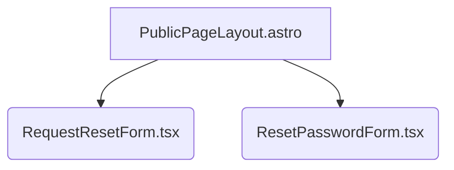

# View Implementation Plan: Reset Password

## 1. Overview
This document outlines the implementation plan for the "Reset Password" view. The purpose of this view is to allow users who have forgotten their password to securely reset it. The process is divided into two main stages:
1.  Requesting a password reset link via email.
2.  Setting a new password using a secure, tokenized link.

The entire flow is handled by the Supabase client SDK, requiring no custom backend endpoints.

## 2. View Routing
-   **/reset-password**: This page will host the `RequestResetForm` component, allowing users to enter their email address to initiate the password reset process.
-   **/update-password**: This page will host the `ResetPasswordForm` component. Users will be redirected to this page from the link sent to their email. The Supabase SDK will handle the session recovery from a token in the URL fragment.

## 3. Component Structure
The view will be structured using a layout and two primary React components:



-   `PublicPageLayout.astro`: A static Astro layout providing a consistent public-facing page structure (e.g., header, footer, styling) for non-authenticated views.
-   `RequestResetForm.tsx`: A client-side React form for submitting an email to request a password reset link.
-   `ResetPasswordForm.tsx`: A client-side React form for entering and confirming a new password.

## 4. Component Details

### RequestResetForm.tsx
-   **Component Description**: A form that allows a user to request a password reset link. It consists of a single email input field and a submit button. It manages its own state for form input, submission status, and feedback messages (e.g., success or error).
-   **Main Elements**: `Card`, `CardHeader`, `CardTitle`, `CardContent`, `CardFooter` from Shadcn/ui for structure. `Form`, `FormField`, `FormItem`, `FormLabel`, `FormControl`, `FormMessage` for the form structure. `Input` for the email field and `Button` for submission.
-   **Handled Interactions**:
    -   User types their email into the input field.
    -   User clicks the "Send Reset Link" button, which triggers form validation and submission.
-   **Handled Validation**:
    -   The email field must not be empty.
    -   The email field must contain a valid email format (e.g., `user@example.com`).
-   **Types**:
    -   **ViewModel**: `RequestResetFormValues = { email: string; }`
-   **Props**: None.

### ResetPasswordForm.tsx
-   **Component Description**: A form that allows a user to set a new password after being redirected from their email. It consists of a password input, a password confirmation input, and a submit button. It handles the password update via the Supabase SDK.
-   **Main Elements**: `Card` and related components for structure. `Form` and related components for the form. Two `Input` fields (type="password") and a `Button`.
-   **Handled Interactions**:
    -   User types a new password.
    -   User confirms the new password.
    -   User clicks the "Set New Password" button, triggering validation and the update process.
-   **Handled Validation**:
    -   The password field must not be empty.
    -   The password must be at least 8 characters long.
    -   The password confirmation must match the password field.
-   **Types**:
    -   **ViewModel**: `ResetPasswordFormValues = { password: string; confirmPassword: string; }`
-   **Props**: None.

## 5. Types
As this feature relies on the Supabase SDK, no new DTOs are required. The following local ViewModel types will be defined within their respective components:

-   **`RequestResetFormValues`**: An object representing the data for the reset request form.
    ```typescript
    interface RequestResetFormValues {
      email: string; // The user's email address.
    }
    ```

-   **`ResetPasswordFormValues`**: An object representing the data for the new password form.
    ```typescript
    interface ResetPasswordFormValues {
      password: string; // The new password.
      confirmPassword: string; // The confirmation of the new password.
    }
    ```

## 6. State Management
State will be managed locally within each React component using React hooks (`useState`). No custom hooks are required for this view.

-   **`RequestResetForm.tsx`**: Will use `useState` to manage:
    -   `isSubmitting` (boolean): To disable the form during the API call.
    -   `formMessage` ({ type: 'success' | 'error', text: string } | null): To display feedback to the user after submission.

-   **`ResetPasswordForm.tsx`**: Will use `useState` to manage:
    -   `isSubmitting` (boolean): To disable the form during the API call.
    -   `error` (string | null): To display any errors that occur during the password update process.

## 7. API Integration
The integration will be handled entirely by the Supabase client-side SDK (`@supabase/supabase-js`).

-   **Requesting Reset Link (`RequestResetForm.tsx`)**:
    -   **Action**: Call `supabase.auth.resetPasswordForEmail()`.
    -   **Request**: The function takes the user's `email` and a `redirectTo` URL.
        ```javascript
        const { error } = await supabase.auth.resetPasswordForEmail(email, {
          redirectTo: `${window.location.origin}/update-password`,
        });
        ```
    -   **Response**: The function returns an object containing an `error` property if the request fails.

-   **Updating Password (`ResetPasswordForm.tsx`)**:
    -   **Action**: Call `supabase.auth.updateUser()`.
    -   **Request**: The function takes an object with the new `password`.
        ```javascript
        const { error } = await supabase.auth.updateUser({ 
          password: newPassword 
        });
        ```
    -   **Response**: The function returns an object with an `error`. If successful, the user's session is updated, and they can be redirected to the login page.

## 8. User Interactions
-   **User requests a reset link**:
    1.  User navigates to `/reset-password`.
    2.  Enters their email and clicks "Send Reset Link".
    3.  The button becomes disabled, and a loading indicator appears.
    4.  On success, the form is replaced with a success message: "If an account with this email exists, a password reset link has been sent."
    5.  On failure, an error message is displayed below the form.
-   **User sets a new password**:
    1.  User clicks the link in their email and is redirected to `/update-password`.
    2.  User enters and confirms their new password.
    3.  User clicks "Set New Password".
    4.  The button is disabled.
    5.  On success, the user is automatically redirected to the `/login` page with a success message.
    6.  On failure (e.g., expired token), an error message is shown.

## 9. Conditions and Validation
-   **`RequestResetForm`**:
    -   **Condition**: Email is required and must be a valid format.
    -   **Verification**: Client-side validation using `zod` and `react-hook-form`.
    -   **Effect**: If invalid, an error message is displayed under the input, and the form is not submitted.
-   **`ResetPasswordForm`**:
    -   **Condition**: Password is required and must be at least 8 characters.
    -   **Condition**: Password confirmation must match the password.
    -   **Verification**: Client-side validation using `zod` and `react-hook-form`.
    -   **Effect**: If invalid, error messages are displayed, and the form is not submitted.

## 10. Error Handling
-   **Invalid Email in `RequestResetForm`**: Handled by client-side validation.
-   **Network or Supabase Error in `RequestResetForm`**: A generic error message will be displayed to the user (e.g., "An unexpected error occurred. Please try again."). The specific error will be logged to the console for debugging.
-   **Invalid/Expired Token in `ResetPasswordForm`**: Supabase's `updateUser` call will fail. An error message will be displayed: "This password reset link is invalid or has expired. Please request a new one."
-   **Password Mismatch**: Handled by client-side validation.

## 11. Implementation Steps
1.  **Create Astro Pages**: Create `src/pages/reset-password.astro` and `src/pages/update-password.astro`.
2.  **Layout Integration**: In both Astro pages, import and use the `PublicPageLayout.astro` to wrap the content.
3.  **Create `RequestResetForm` Component**:
    -   Create the file `src/components/auth/RequestResetForm.tsx`.
    -   Implement the form using Shadcn/ui components (`Card`, `Form`, `Input`, `Button`).
    -   Set up `react-hook-form` with a `zod` schema for validation (email required and valid).
    -   Implement the `onSubmit` handler to call `supabase.auth.resetPasswordForEmail` with the correct `redirectTo` URL.
    -   Add state for `isSubmitting` and `formMessage` to provide user feedback.
4.  **Create `ResetPasswordForm` Component**:
    -   Create the file `src/components/auth/ResetPasswordForm.tsx`.
    -   Implement the form for the new password and confirmation.
    -   Set up `react-hook-form` with a `zod` schema for validation (password length, password match).
    -   Implement the `onSubmit` handler to call `supabase.auth.updateUser`.
    -   On successful update, programmatically redirect the user to `/login`.
    -   Handle and display errors from the API call.
5.  **Integrate Components into Pages**:
    -   In `reset-password.astro`, import and render the `RequestResetForm` component with `client:load`.
    -   In `update-password.astro`, import and render the `ResetPasswordForm` component with `client:load`.
6.  **Configure Supabase**: In the Supabase project settings (Authentication -> URL Configuration), ensure the "Site URL" is set correctly and add `http://<your-dev-url>/update-password` to the "Redirect URLs" list.
7.  **Testing**: Thoroughly test the entire flow: requesting a link, using the link, handling expired links, and confirming login with the new password.
