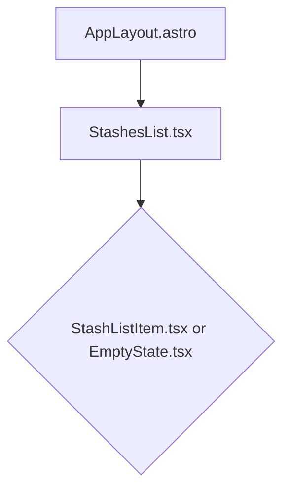

# View Implementation Plan: Stashes List

## 1. Overview
This document outlines the implementation plan for the **Stashes List** view. This view serves as the primary dashboard for users to see an overview of all their savings stashes. It will display a list of stashes, each showing its name and current balance. The view will be accessible to authenticated users and will provide navigation to the detailed view for each stash.

## 2. View Routing
- **Path**: `/app/stashes`
- **Page Component**: `src/pages/app/stashes.astro`

## 3. Component Structure
The view will be composed of the following components in a hierarchical structure:



- `AppLayout.astro`: The main layout for authenticated sections of the application.
- `StashesList.tsx`: The main React component responsible for fetching and displaying the list of stashes.
- `StashListItem.tsx`: A React component to display a single stash's information (name and balance).
- `EmptyState.tsx`: A component to be displayed when the user has no stashes.

## 4. Component Details

### AppLayout.astro
- **Component Description**: This is a site-wide Astro layout component that wraps content for pages accessible only to authenticated users. It provides a consistent look and feel, including navigation and user-specific elements.
- **Main Elements**: It will contain slots for the page content. The `StashesList` component will be placed inside its default slot.
- **Handled Interactions**: None directly. It provides the overall page structure.
- **Props**: Accepts a `title` prop for the page title.

### StashesList.tsx
- **Component Description**: This dynamic React component is the core of the view. It fetches the list of stashes from the API, manages the view's state (loading, data, errors), and renders the list of stashes or an empty state message.
- **Main Elements**: 
    - A container `div`.
    - A loading indicator (e.g., a spinner) shown while data is being fetched.
    - An error message display area.
    - A list container (`ul` or `div`) that maps over the stashes data and renders a `StashListItem` for each.
    - An `EmptyState` component, shown if the stashes list is empty.
- **Handled Interactions**: This component will trigger the API call to fetch stashes when it mounts.
- **Validation Conditions**: None at the component level. It relies on the API for data.
- **Types**: 
    - `StashListItemDTO`
    - `ApiPaginatedResponse<StashListItemDTO>`
- **Props**: None.

### StashListItem.tsx
- **Component Description**: A presentational React component that displays the information for a single stash. It acts as a link to the stash's detail page.
- **Main Elements**:
    - An `<a>` tag wrapping the entire component, with `href` pointing to `/app/stashes/{stash.id}`.
    - A `div` to display the stash name.
    - A `div` to display the formatted `current_balance` in PLN.
- **Handled Interactions**: Clicking on the component will navigate the user to the stash detail page.
- **Validation Conditions**: None.
- **Types**: `StashListItemViewModel`
- **Props**:
    - `stash: StashListItemViewModel`

### EmptyState.tsx
- **Component Description**: A simple component to inform the user that they have not created any stashes yet. It may include a call-to-action to create one.
- **Main Elements**:
    - A container `div`.
    - A message, e.g., "You don't have any stashes yet."
    - Optionally, a button or link to the 'Create Stash' page/modal.
- **Handled Interactions**: None.
- **Validation Conditions**: None.
- **Props**: None.

## 5. Types

### DTOs (from API)
- **`StashListItemDTO`**: The data transfer object for a single stash item received from the API.
  ```typescript
  export type StashListItemDTO = {
    id: string; // UUID
    name: string;
    current_balance: number;
    created_at: string; // ISO 8601 timestamp
    updated_at: string; // ISO 8601 timestamp
  };
  ```

- **`ApiPaginatedResponse<StashListItemDTO>`**: The shape of the paginated response from the `/api/stashes` endpoint.
  ```typescript
  export interface ApiPaginatedResponse<T> {
    data: T[];
    pagination: {
      page: number;
      limit: number;
      total: number;
    };
  }
  ```

### ViewModels (for Components)
- **`StashListItemViewModel`**: A type tailored for the `StashListItem` component, with formatted data for display.
  ```typescript
  export type StashListItemViewModel = {
    id: string;
    name: string;
    balance: string; // Formatted as currency, e.g., "1,234.56 zł"
    url: string; // e.g., "/app/stashes/{id}"
  };
  ```

## 6. State Management
State will be managed within the `StashesList.tsx` component using React hooks. A custom hook `useStashes` is recommended to encapsulate the logic for fetching data, and managing loading and error states.

- **`useStashes` Custom Hook**:
  - **Purpose**: To handle the lifecycle of fetching stashes from the API.
  - **State Variables**:
    - `stashes: StashListItemDTO[]`: Stores the fetched list of stashes.
    - `isLoading: boolean`: Tracks the loading state of the API request.
    - `error: Error | null`: Stores any error that occurs during the fetch.
  - **Functionality**: It will use `useEffect` to trigger the API call on component mount. It will handle setting the `stashes`, `isLoading`, and `error` states based on the API response.

## 7. API Integration
- **Endpoint**: `GET /api/stashes`
- **Request**: The frontend will make a GET request to this endpoint. Initially, it can be called without query parameters to use the API's defaults.
  - **Request Type**: `void` (no body)
- **Response**: The API will return a JSON object conforming to `ApiPaginatedResponse<StashListItemDTO>`.
  - **Response Type**: `ApiPaginatedResponse<StashListItemDTO>`
- **Integration**: The `useStashes` hook will use the `fetch` API or a library like `axios` to call the endpoint. The response data will be used to populate the state.

## 8. User Interactions
- **View Load**: When the `/app/stashes` page loads, the `StashesList` component mounts and triggers the `useStashes` hook to fetch the list of stashes. A loading indicator is shown.
- **Data Loaded**: Once the data is fetched successfully, the loading indicator is hidden, and the list of stashes is rendered. If no stashes are returned, the `EmptyState` component is shown.
- **Click Stash Item**: A user can click on any `StashListItem`. This action, handled by the `<a>` tag, navigates them to the corresponding stash detail page at `/app/stashes/{stash.id}`.
- **API Error**: If the API call fails, an error message is displayed to the user.

## 9. Conditions and Validation
- **Authentication**: The view is only accessible to authenticated users. This will be enforced by Astro middleware, which will redirect unauthenticated users to the login page.
- **Data Fetching**: The `StashesList` component will display different UI states based on the API call status:
    - **Loading**: A loading spinner or skeleton loader is displayed.
    - **Success (with data)**: The list of `StashListItem` components is rendered.
    - **Success (no data)**: The `EmptyState` component is displayed.
    - **Error**: An error message is shown.

## 10. Error Handling
- **API Errors**: If the `fetch` call to `/api/stashes` fails (e.g., network error, 500 status code), the `error` state in `useStashes` will be set. The `StashesList` component will then render a user-friendly error message, like "Could not load stashes. Please try again later."
- **Unauthorized Access**: While middleware should handle redirection, if an API call returns a `401 Unauthorized` status, the application should ideally log the user out and redirect them to the login page.

## 11. Implementation Steps
1.  **Create Page Route**: Create the Astro page file `src/pages/app/stashes.astro`.
2.  **Layout Integration**: Inside `stashes.astro`, use the `AppLayout.astro` component and give it an appropriate title.
3.  **Create `StashesList` Component**: Create the React component file `src/components/stashes/StashesList.tsx`. Implement the basic structure with placeholders for loading, error, and empty states.
4.  **Implement `useStashes` Hook**: Create the custom hook `src/components/hooks/useStashes.ts`. Implement the state logic and the `useEffect` to fetch data from `/api/stashes`.
5.  **Integrate Hook**: Use the `useStashes` hook in `StashesList.tsx` to get the stashes data, loading, and error states. Implement the conditional rendering logic.
6.  **Create `StashListItem` Component**: Create the React component file `src/components/stashes/StashListItem.tsx`. It should accept a `stash` prop of type `StashListItemViewModel`.
7.  **Data Transformation**: In `StashesList.tsx`, map the fetched `StashListItemDTO[]` to `StashListItemViewModel[]`, formatting the balance as a currency string and creating the URL for each item.
8.  **Render List**: In `StashesList.tsx`, render the `StashListItem` components by mapping over the view model data.
9.  **Create `EmptyState` Component**: Create `src/components/stashes/EmptyState.tsx` with a message for users with no stashes.
10. **Final Assembly**: Ensure all components are correctly imported and rendered within `stashes.astro`.
11. **Styling**: Apply Tailwind CSS classes to all new components to match the application's design system.
